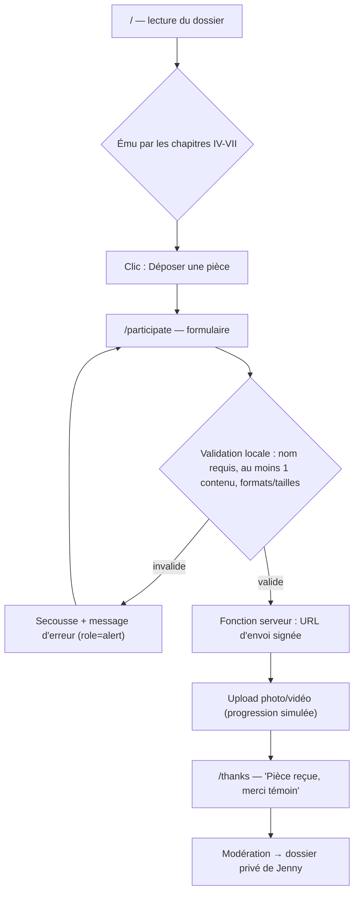

# Audit complet & déconstruction pédagogique
## « Dossier N°18 — Affaire Jenny » — https://dossier-jenny18ans.netlify.app/

> Rapport destiné à un étudiant de L2 Génie logiciel (IFRI-UAC).
> Date de l'audit : 3 octobre 2026.
> Méthode : analyse réelle du site (téléchargement du HTML, du bundle JavaScript minifié, du CSS, des en-têtes HTTP, de robots.txt/sitemap.xml, rendu des routes par navigateur automatisé). Aucun accès au code source original, aucun compte, aucun test intrusif.

**Légende des statuts** — utilisée dans tout le rapport :
- ✅ **Vérifié** : observé directement (code public, en-têtes, fichiers, rendu).
- 🟢 **Fortement probable** : plusieurs indices cohérents, sans preuve directe.
- 🟡 **Hypothèse** : explication plausible, non étayée.
- ⚫ **Inconnu** : impossible à déterminer avec les moyens disponibles.

---

# 0. Moyens d'inspection utilisés (transparence méthodologique)

| Moyen | Ce qu'il a permis | Limites |
|---|---|---|
| `curl` sur `/`, `/participate`, `/jenny`, `/thanks`, routes aléatoires | Vérifier le statut HTTP, les en-têtes, le fallback SPA, les tailles | Pas de mesure de performance réelle |
| Lecture du `index.html` complet (736 997 octets) | Structure du `<head>`, métadonnées, scripts et styles inline | — |
| Extraction et lecture du bundle JS minifié (~660 Ko) | Identifier React, le routeur, Supabase, les hooks d'animation, les routes, la logique du formulaire et de la porte privée | Code minifié : les noms de variables sont courts, mais la logique est lisible |
| Extraction du CSS inline (~73 Ko) | Palette, polices, keyframes, media queries, reduced-motion | — |
| Rendu automatisé des pages (navigateur sans tête exécutant le JS) | Contenu réel de `/`, `/participate`, `/thanks`, `/jenny`, 404 | **Pas d'interactions** (hover, clic, scroll) : les comportements interactifs sont déduits du code, pas testés à la main |
| Requête DNS vers `*.supabase.co` | — | **Bloquée dans mon environnement** : l'état réel des Edge Functions n'a pas pu être testé |

**Ce que je n'ai PAS pu faire** : tester les animations visuellement, tester les viewports tablette/mobile sur appareil réel, exécuter un Lighthouse, inspecter le dépôt source (aucun dépôt public n'a été trouvé ni fourni), soumettre une contribution réelle (je n'ai pas envoyé de données au site).

---

# PARTIE A — IDENTITÉ ET COMPRÉHENSION DU PRODUIT

## A1. Présentation générale

| Aspect | Description | Source |
|---|---|---|
| Nom | « Dossier N°18 — Affaire Jenny » (title HTML) | ✅ Vérifié |
| Auteur déclaré | `meta author = "Stane"` ; un témoignage est signé « Stane alias Pinou » | ✅ Vérifié. Que « Stane » soit le pseudonyme d'Amoussou Siméon : 🟡 Hypothèse |
| Objectif | Cadeau d'anniversaire numérique : célébrer les 18 ans **et** l'obtention du bac de Jenny (« Méminou »), le 13 août | ✅ Vérifié (contenu) |
| Problème résolu | Aucun problème « marché » : c'est un objet affectif. Il résout le problème *« comment transformer un anniversaire en expérience mémorable, collective et rejouable »* | Déduction logique du contenu |
| Public | 1) les proches de Jenny (invités à contribuer) ; 2) Jenny elle-même (destinataire d'une partie privée) | ✅ Vérifié (deux parcours distincts dans le site) |
| Proposition de valeur | « Une enquête officielle, preuves à l'appui, menée par ceux qui t'aiment » — l'affection mise en scène comme une affaire judiciaire | ✅ Vérifié |
| Type de produit | Site-événement / expérience narrative interactive (ni portfolio, ni SaaS). Proche du « web cadeau » | ✅ Classification |
| Contexte d'usage | Préparé avant le 13 août ; le dossier « reste ouvert jusqu'au 13 août » ; une pièce « sera versée le jour J » | ✅ Vérifié (textes) |
| Actions visiteur | Lire le dossier (scroll narratif) ; déposer un message/photo/vidéo ; (Jenny) ouvrir la porte privée | ✅ Vérifié |

## A2. Logique produit

Le site repose sur une **double audience** — c'est sa décision de conception la plus importante :

1. **Parcours public** : le visiteur lit une « enquête » en 7 chapitres, puis est invité à *déposer une pièce à conviction* (formulaire `/participate`). Toute la fiction (« PV », « pièces », « scellés », « témoins », « verdict ») sert un seul but de conversion : transformer le visiteur en contributeur.
2. **Parcurs privé** : Jenny accède via `/jenny` (porte avec email + mot de passe « préparés pour elle ») à la même histoire, enrichie des contributions approuvées. Les contributions passent par une **modération** : « Les pièces sont examinées avant d'être versées au dossier privé de Jenny » ✅ (texte du formulaire).

Éléments de conversion observés : deux CTA dans le hero (« Ouvrir le dossier », « Vous êtes témoin ? Déposer une pièce »), rappel d'appel à témoins au chapitre IV/V, section « Appel à témoins » finale avec double lien (déposer / accès privé). Éléments secondaires : la salle de projection publique (bandes de démonstration), la fiche d'identification.

Je ne suppose rien des intentions personnelles du concepteur ; l'interface *suggère* une logique : **faire participer l'entourage → sceller les preuves → offrir le tout à Jenny le jour J, avec une part de secret** (pièce A-06 « sous scellés »).

## A3. Synthèse du fonctionnement

Le site est une application monopage (SPA) React : une seule page HTML « coquille vide », tout est rendu par JavaScript dans le navigateur, et le routeur gère 6 routes. Le contenu statique (histoire, photos) est embarqué dans le bundle ; les contributions des proches passent par Supabase (base de données + stockage de fichiers + fonctions serveur) ; la zone privée de Jenny recharge les contributions approuvées via une fonction serveur protégée par un jeton.

```
Visiteur → Découverte (7 chapitres narratifs, scroll)
        → Émotion/immersion (témoignages, films, verdict)
        → Action principale : déposer une pièce (message/photo/vidéo)
        → Envoi via fonction serveur + stockage média
        → Modération → Résultat : la pièce rejoint le dossier privé de Jenny le 13 août
```

---

# PARTIE B — AUDIT VISUEL ET UI/UX

## B1. Direction artistique

L'identité est celle d'un **dossier d'enquête judiciaire vintage, photographié au flash, de nuit**. Chaque choix converge :

- **Couleurs** (✅ extraites du thème CSS, variables Tailwind v4) :

| Jeton | Valeur | Rôle observé |
|---|---|---|
| `ink` | `#0C0709` | Fond principal (noir presque pur, chaud) — confirmé par `theme-color` |
| `deep` | `#070405` | Fond plus profond (dégradés) |
| `coal` / `ash` | `#171013` / `#241a1e` | Surfaces élevées |
| `parch` / `bone` / `paper` | `#F4EBDA` / `#EDE3CF` / `#ECE1CC` | Textes clairs, ton « parchemin » |
| `fog` | `#A89A86` | Texte secondaire (taupe) |
| `blood` | `#C8102E` | Rouge principal (tampons, CTA) |
| `ember` | `#E8404A` | Rouge vif (accents, braises du canvas) |
| `wine` | `#6E0B1E` | Rouge sombre (profondeurs) |
| `brass` | `#C9A227` | Or/laiton (sceau, papillon, mentions) |

- **Typographies** (✅ Google Fonts, `display=swap`) : **Fraunces** (serif expressive, italiques dramatiques — titres), **IBM Plex Mono** (machine à écrire — tout le « corps administratif » du dossier), **Caveat** (manuscrite — annotations). Ce trio *raconte* : le mono est l'institution, la serif est l'émotion, la manuscrite est l'intime.
- **Contraste** : texte parchemin sur encre → contraste très élevé ; `fog` (~`#A89A86` sur `#0C0709`) reste lisible mais plus discret — hiérarchie par la luminosité plutôt que par la taille, typique des UI « document ».
- **Boutons** : classe `btn-stamp` — rectangulaires, bordure fine `ember/60`, fond `blood`, texte mono uppercase `tracking-[0.2em]`, 11px. Aucun arrondi visible : l'univers est *administratif*, pas « app moderne ».
- **Motifs graphiques** : tampons inclinés (`stamp-in`, rotation `-7°`/`-8°`), grain photographique animé (calque de bruit SVG), marquee typographique, références « J-18/08-13 », numérotation « Pièce A-0X », point REC clignotant, sceau rotatif.
- **Espaces** : sections très aérées (`py-24` → `py-36` en desktop), conteneurs `max-w-3xl`/`max-w-2xl` centrés : le vide fait partie de la mise en scène (salle d'archives).

**Effet produit** : le visiteur n'a pas l'impression de lire une page web mais de *consulter un dossier confidentiel*. La cohérence entre textes, couleurs, polices et animations est totale — c'est la force principale du site.

## B2. Système de design observable

| Élément | Observation | Valeur mesurée ou estimée | Confiance |
|---|---|---|---|
| Palette | 12 jetons de couleur nommés sémantiquement (`ink`, `blood`, `brass`…) | Voir B1 | ✅ Élevée (CSS) |
| Échelle typo | Tailles utilitaires Tailwind ; titres hero `clamp(2.2rem,5vw,3.8rem)` observés dans le code des pages intérieures ; corps mono 11–13px, interlettrage 0.14–0.3em | Valeurs vues dans le bundle | ✅ Élevée |
| Espacements | Sections `px-5 py-16/24`, `md:px-12`, `lg:px-20` | ✅ Classes dans le code | Élevée |
| Conteneurs | `max-w-2xl` à `max-w-3xl` centrés pour le texte | ✅ | Élevée |
| Grille | Hero en `lg:grid-cols-[1.15fr_0.85fr]` ; cartes de pièces en grille | ✅ | Élevée |
| Breakpoints | `40rem / 48rem / 64rem / 80rem` (640/768/1024/1280 px) + un `max-width:767px` | ✅ Media queries du CSS | Élevée |
| Boutons | Variante unique `btn-stamp` + liens texte mono soulignés | ✅ | Élevée |
| Cartes | « Pièces » avec cadre, étiquette mono, mention, date « Versée le 13.08 » | ✅ Contenu | Élevée |
| Champs formulaire | Étiquettes mono uppercase, compteurs `0 / 80`, `0 / 2000` | ✅ Rendu `/participate` | Élevée |
| États interactifs | `hover:` sur liens/boutons (changement de couleur), `focus` bordure `blood/brass/ember` | ✅ CSS | Élevée |
| Responsive | Approche mobile-first (`px-5` puis `md:`/`lg:`) | ✅ | Élevée |

## B3. Ergonomie et expérience utilisateur

**Points forts observés :**
- Compréhension immédiate : la métaphore du dossier est autoportante (tampon « Confidentiel », fiche d'identification du sujet).
- Navigation : pas de menu complexe — un header discret avec fil d'Ariane de chapitre (« Réf. J-18/08-13 — I — Couverture ») qui suit le scroll ✅ (code du header avec observateur `[data-chapter]`).
- Retours d'action : le bouton du formulaire a 5 états (repos, « Versement N%… », « Traitement… », « Versé ✓ », erreur avec secousse + `role="alert"`) ✅ (code).
- La page `/thanks` refuse l'accès direct sans confirmation (« Dépôt non confirmé ») ✅ (rendu testé) — anti-fausse-confirmation, détail professionnel.

**Frictions possibles :**
- Sur petit écran, la densité de texte mono uppercase peut fatiguer la lecture (observation, non mesurée).
- Le CTA « Ouvrir le dossier » pointe vers `#rapport` : c'est un défilement, pas une action « ouvrir » — légère dissonance entre le verbe et l'effet (interprétation).
- L'accès `/jenny` demande un email + mot de passe que seuls Jenny et l'auteur connaissent : c'est voulu, mais un visiteur curieux arrive sur une porte fermée sans explication de *qui* contacter — la page dit « Préviens la personne qui t'a transmis l'accès » ✅, ce qui est correct.
- Pas de fallback `<noscript>` (⚫ absence constatée) : sans JavaScript, page blanche.

---

# PARTIE C — DÉCONSTRUCTION DE LA LANDING PAGE

Le site est découpé en **7 chapitres déclarés** ✅ (`data-chapter` dans le code) : I Couverture, II Rapport préliminaire, III Pièces à conviction, IV Témoignages, V Salle de projection, VI Verdict, VII Affaire classée. Composants identifiés dans le bundle : `Wy` (couverture), `Xy` (rapport), `Qy` (pièces), `MN` (témoignages), `$N` (projection), `PN` (verdict), `IN` (clôture).

> Note : je n'ai pas pu tester les interactions au survol/clic ; les comportements ci-dessous proviennent du code rendu public et du rendu statique.

### Fiche 0 — Header + Layout global
1. **Layout racine** (`c2`) — 2. Position : permanente — 3. Cadre institutionnel + accessibilité — 4. Contenu : lien d'évitement « Aller au contenu » ✅, header, `<main id="main">`, footer, calque de grain — 5/6. Fond `ink`, texte `bone`, police mono par défaut — 9. Skip-link visible au focus ✅ — 10. Grain animé global (`noise-layer`) — 11. `min-h-screen`, fluide — 12. **À apprendre** : skip-link + composition layout = `<div> root → header / main / footer / overlays` — 14. Contenu exact du footer non extrait en détail (présent : composant `u2`).

### Fiche 1 — Chapitre I « Couverture » (hero)
1. **Couverture du dossier** — 2. Écran d'ouverture, `min-h-svh` — 3. Capter, planter la fiction, donner 2 CTA — 4. Bandeau supérieur « République de ceux qui t'aiment — Division des affaires extraordinaires / Réf. J-18/08-13 » ; tampon « Confidentiel — Dossier ouvert le 13 août » ; titre `H1` « Dossier N°18 — l'affaire **Jenny.** » ; sous-titre ; 2 CTA ; **Fiche d'identification** (tableau : Sujet, Alias « Méminou », Âge, Statut « Bachelière. Avec la manière. », Signes particuliers, Dernière localisation) ; avertissement « Signes d'ADN félin détectés » ; marquee « DIX-HUIT ANS • BAC OBTENU • … » — 5. Grille 2 colonnes en `lg` (`1.15fr / 0.85fr`), empilé en mobile — 6. Hiérarchie : tampon → titre → accroche → CTA → fiche — 8. Image `emblem-cat.jpg` (emblème chat, 110 Ko) ; papillon doré (`papillon-or.jpg`, 96 Ko) dérivant en boucle — 9. Boutons `btn-stamp` — 10. Entrée en cascade `rise-in` avec délais (`--rise-delay` 80 ms, 180 ms…) ✅ code ; marquee 30 s ; papillon 11 s — 11. La grille passe en colonne sous `lg` — 12. CSS : `fade-rise` + variables de délai ; SVG/img pour l'emblème — 13. **À apprendre** : l'entrée en cascade par variable CSS de délai (une seule classe, des délais différents par élément) — 14. Comportement hover exact des CTA non testé visuellement.

**Pertinence dans le parcours** : la couverture *qualifie* le visiteur (on comprend en 3 secondes qui, quoi, pourquoi) et pose immédiatement la double sortie : lire (`#rapport`) ou participer (`#deposer`).

### Fiche 2 — Chapitre II « Rapport préliminaire »
1. PV d'ouverture — 2. Après le hero — 3. Raconter l'« affaire » et faire la transition vers les preuves — 4. Titre « Rapport préliminaire », étiquette « PV N°001 — certifié conforme », texte dactylographié, compteur « Pièces versées : 05 / Disparues : 00 / Hiérarchie confirmée : chaton > lapin » — 9/10. **Machine à écrire** : le texte se tape caractère par caractère (`text.slice(0, chars)` + curseur clignotant `caret-blink`) ✅ code ; à la fin (`done`), une conclusion et le lien « Examiner les pièces à conviction » apparaissent — 12. Implémentation probable : `setInterval`/rAF incrémentant un compteur de caractères dans un `useEffect` — 13. **À apprendre** : révéler la suite *seulement* quand la frappe est finie (état `done`) : le motion guide l'ordre de lecture.

### Fiche 3 — Chapitre III « Pièces à conviction »
1. Galerie des preuves — 2. Cœur affectif public — 3. Présenter Jenny par ses objets — 4. 6 cartes : A-01 Le Chaton (« SUSPECT PRINCIPAL »), A-02 Le Lapin (« COMPLICE PRÉSUMÉ »), A-03 Les Carnets (« PIÈCE LITTÉRAIRE » — clins d'œil *Les Carnets de l'apothicaire*, Maomao/Jinshi), A-04 Nuit blanche (films d'horreur), A-05 Le Bac (« PIÈCE MAÎTRESSE »), A-06 **Sous scellés** (vide, « versée le jour J ») — 5. Cartes : photo « au flash » légendée, étiquette de statut, titre serif, description, mention en italique, horodatage « Versée le 13.08 — dossier J-18 » — 8. 5 photos JPEG 110–200 Ko chacune, alts descriptifs soignés ✅ — 10. Apparition au scroll (`data-reveal`) — 13. **À apprendre** : la carte A-06 *vide* : créer l'attente avec une absence. — 14. Effet hover précis des cartes non testé.

### Fiche 4 — Chapitre IV « Témoignages » *(la pièce maîtresse technique)*
1. « Ce qu'ils voulaient *te dire.* » — 2. Après les preuves matérielles, les preuves humaines — 3. Faire lire des messages personnels — 4. Témoins identifiés dans le code : Gloria, Lauris, « Stane alias Pinou », « Expert alias Ton chaton », chacun avec photo (`/temoignage/*.jpeg`, accès vérifié 200 pour l'une) — 5/6. Section « scène » : un seul témoignage net au centre, les autres en retrait (flous/estompés), une orbe lumineuse se déplace le long d'un tracé SVG — 10. **Tout est piloté par le scroll** : variable CSS `--testimonial-progress`, calculs d'activation par smoothstep, statuts `past/active/settled/future` ✅ code — 11. En `prefers-reduced-motion`, tout est affiché statiquement ✅ — 12. Voir partie D — 13. **À apprendre** : c'est l'exemple le plus riche du site (voir J4).

### Fiche 5 — Chapitre V « Salle de projection »
1. Cinéma du dossier — 2. Après les voix, les images animées — 3. Montrer les films-souvenirs — 4. Bandes avec étiquettes « CAM 02 — SALON », transcriptions (« 00:00 — … versé au dossier »), lecteur avec affiche — 9/10. Lecture/pause automatique à 35 % de visibilité (IntersectionObserver) ✅ code ; en mode privé, les contributions vidéo approuvées remplacent/complètent les bandes, avec message de repli si Supabase est injoignable ✅ code — 12. `video.play().catch(...)` pour gérer les promesses de lecture refusées — 13. **À apprendre** : gérer proprement `play()` (promesse rejetée si l'autoplay est bloqué).

### Fiche 6 — Chapitre VI « Verdict »
1. Le délibéré — 2. Climax émotionnel — 3. Formuler la déclaration d'amour — 4. « Le jury — composé de tous les témoins ci-dessus — a délibéré » ; fond radial rouge — 10. À l'entrée : une **secousse unique** de la section (`shake-once` déclenché par l'état `inView`) + **pluie de braises** sur canvas (points or `#C9A227` et rouge `#E8404A` montant avec une oscillation sinusoïdale) ✅ code — 12. Canvas 2D + `requestAnimationFrame`, activé uniquement quand visible — 13. **À apprendre** : un système de particules de ~40 lignes, coupé hors écran.

### Fiche 7 — Chapitre VII « Affaire classée » + appel à témoins
1. Clôture + conversion — 2. Fin de page — 3. Convertir : déposer une pièce ; aiguiller Jenny — 4. Section « Appel à témoins » : « Vous avez une preuve d'amour ? » + liens `Déposer une pièce →` et `Accès Jenny (privé)` ✅ — 13. Le dernier écran *est* le CTA : la boucle narrative débouche sur l'action.

### Fiche 8 — 404
« Pièce manquante / 404 — Ce chapitre n'existe pas au dossier. » ✅ rendu testé : même en erreur, la fiction continue (et le bouton « Retour au dossier N°18 »).

---

# PARTIE D — ANALYSE DES ANIMATIONS ET DU MOTION DESIGN *(partie prioritaire)*

## D1. Inventaire des animations

| ID | Élément | Déclencheur | Effet visible | Durée | Délai | Répétition | Dépend scroll | Responsive | Technologie | Confiance |
|---|---|---|---|---|---|---|---|---|---|---|
| AN-01 | Hero (tampon, bandeau, titre, fiche) | Chargement | Fondu + montée de 22px (`fade-rise`) | 0,9 s | 80/180/… ms via `--rise-delay` | Unique | Non | ✅ classes `md:` | CSS keyframes | ✅ Élevée |
| AN-02 | Tout bloc `[data-reveal]` | Entrée dans le viewport | Opacité 0→1, translateY(28px)→0 | 0,9 s (opacité) / 1 s (transform) | `--reveal-delay` par élément | Unique | Oui (IO) | Oui | IntersectionObserver + CSS transitions | ✅ Élevée |
| AN-03 | Titre « l'affaire Jenny. » / textes du PV | Entrée visible | Machine à écrire + curseur clignotant | Non mesurable (dépend de la longueur) ; curseur 0,8 s `steps(2)` | — | Curseur : continue | Oui (démarre à la visibilité) | — | JS (état `chars`) + CSS | ✅ code |
| AN-04 | Marquee « DIX-HUIT ANS… » | Chargement | Translation continue −50 % | 30 s, linéaire | — | Continue | Non | — | CSS `marquee-x` | ✅ Élevée |
| AN-05 | Grain photographique | Chargement | Calque de bruit qui « saute » | 1,2 s `steps(4)` | — | Continue | Non | Désactivé si reduced-motion | CSS + SVG `feTurbulence` | ✅ Élevée |
| AN-06 | Papillon doré | Chargement | Dérive + rotation (−6°→+6°) | 11 s ease-in-out | — | Continue | Non | — | CSS `butterfly-drift` | ✅ Élevée |
| AN-07 | Sceau / texte circulaire | Chargement | Rotation 360° | 46 s linéaire | — | Continue | Non | — | CSS `seal-spin` | ✅ Élevée |
| AN-08 | Point REC | Chargement | Clignotement | 1,1 s `step-end` | — | Continue | Non | — | CSS `rec-blink` | ✅ Élevée |
| AN-09 | Éclairages du hero | Chargement | Micro-variations d'opacité | 7 s | — | Continue | Non | — | CSS `flicker` | ✅ Élevée |
| AN-10 | Témoignages (chap. IV) | Scroll | Progression 0→1 de la section ; activation par témoignage (net/flou), orbe SVG sur un chemin | Continue, suit le scroll | — | Réversible | **Oui** | Repli statique si reduced-motion | rAF + variable CSS + SVG `getPointAtLength` | ✅ code |
| AN-11 | Header | Scroll | Barre de progression + nom du chapitre courant | Instantané (rAF) | — | Continue | Oui | — | rAF + IO `rootMargin:-42%/-52%` | ✅ code |
| AN-12 | Braises (chap. VI) | Visibilité | Particules or/rouge montantes | Continue tant que visible | — | Continue | Oui (activation IO) | — | Canvas 2D + rAF | ✅ code |
| AN-13 | Section Verdict | Entrée visible | Secousse unique (±4 px) | 0,45 s, délai 0,28 s | 0,28 s | Unique | Oui (IO) | — | Classe `shake-once` + CSS | ✅ code |
| AN-14 | Tampons (composant `or`) | Montée du composant | Écrasement : scale 2,6→0,92→1,06→1 avec rotation | 0,55 s `cubic-bezier(.2,1.2,.3,1)` | — | Unique | Non | — | CSS `stamp-in` | ✅ Élevée |
| AN-15 | Erreur formulaire | Soumission invalide | Secousse horizontale | 0,4 s ease-out | — | À chaque erreur | Non | — | CSS `deny-shake` | ✅ code |
| AN-16 | Transitions de page | Navigation | Probable View Transition API | ⚫ non mesuré | — | — | Non | — | react-router + « remix-router-transitions » | 🟢 Forte |

Aucune durée n'a été inventée : tout provient du CSS (✅) ou du code JS (✅). Ce que je n'ai pas mesuré : le ressenti réel, les FPS, le comportement sur appareil faible.

## D2/D3. Déconstruction et explication technique des 4 animations majeures

### AN-02 — Le « reveal » au scroll (la brique de base)
- **Élément** : n'importe quel bloc annoté `data-reveal`. **État initial** : `opacity:0; transform:translateY(28px)`. **État final** : `opacity:1; translateY(0)`, classe `is-in`. **Déclencheur** : IntersectionObserver.
- **Logique vérifiée dans le bundle** (hook `Bo` + composant `Ie`) :

```js
// Exemple PÉDAGOGIQUE — reconstruction, pas le code original
function useInView(threshold = 0.2) {
  const ref = useRef(null);
  const [inView, setInView] = useState(false);
  useEffect(() => {
    const el = ref.current;
    if (!el) return;
    if (matchMedia("(prefers-reduced-motion: reduce)").matches) {
      setInView(true); return;                 // accessibilité d'abord
    }
    const io = new IntersectionObserver(([e]) => {
      if (e.isIntersecting) { setInView(true); io.disconnect(); }
    }, { threshold, rootMargin: "0px 0px -6% 0px" });
    io.observe(el);
    return () => io.disconnect();
  }, [threshold]);
  return { ref, inView };
}
```
- **Détails qui comptent** : `io.disconnect()` après la première apparition (une seule fois, pas de rejeu) ; `rootMargin` négatif en bas pour déclencher *un peu avant* que l'élément atteigne le bord ; le délai d'escalier est une simple variable CSS `--reveal-delay` injectée en `style` ; deux courbes distinctes : `cubic-bezier(.22,.61,.36,1)` pour l'opacité, `cubic-bezier(.16,1,.3,1)` (sortie très amortie) pour le déplacement.
- **Alternatives** : GSAP ScrollTrigger (surdimensionné ici), bibli `framer-motion` `whileInView`, ou l'API CSS `animation-timeline: view()` (future, encore trop peu supportée pour un site public en 2025-2026). **Le choix natif observé est le bon** : zéro dépendance, ~20 lignes.

### AN-10 — Les témoignages pilotés par le scroll (la plus sophistiquée)
1. **Élément** : la section entière ; **états** : progression globale `p ∈ [0,1]`, un index actif, et pour chaque carte un poids d'activation.
2. **Déclencheur** : `scroll`, mais throttlé proprement ✅ :

```js
// PÉDAGOGIQUE — la progression d'une section dans la page
const onScroll = () => {
  cancelAnimationFrame(raf);
  raf = requestAnimationFrame(() => {
    const r = el.getBoundingClientRect();
    const total = r.height + innerHeight;
    const p = clamp((innerHeight - r.top) / total, 0, 1);
    setProgress(prev => Math.abs(prev - p) > 0.001 ? p : prev); // évite les re-rendus inutiles
  });
};
addEventListener("scroll", onScroll, { passive: true });
```
3. La progression brute est **remappée** (`(p−0.1)/0.82`) pour que l'action utile occupe 10 %→92 % du défilement ; chaque témoignage a un centre `(i+0.5)/n` et une largeur de fenêtre ; un **smoothstep** `x²(3−2x)` transforme la distance en douceur ; les statuts `past/active/settled/future` pilotent le style (net au centre, flou ailleurs).
4. Une **orbe lumineuse** suit un chemin SVG : `path.getPointAtLength(longueurTotale × p)` positionne un `<circle>` — technique simple et très efficace, vérifiée dans le code (`iy`).
5. Tout est exposé à CSS via `style={{ "--testimonial-progress": p }}`.
6. **Repli** : si `prefers-reduced-motion`, progression forcée à 1 et affichage complet ✅.

**Leçon** : une animation « impressionnante » n'est ici qu'une fonction mathématique du scroll, rendue réactive par une variable CSS. Pas de WebGL, pas de bibliothèque.

### AN-12 — Les braises en canvas (le chapitre du verdict)
- Particules `{x, y, r, a, sway, gold?}` ; à chaque frame : `sway += vitesse ; x += sin(sway)*0.3 ; y -= vitesse` ; alpha = `hauteur restante / hauteur` ; remplissage `#C9A227` ou `#E8404A`.
- **Le détail pro** : le `requestAnimationFrame` ne tourne **que** quand la section est visible (IO `threshold:0`) et s'arrête sinon (`cancelAnimationFrame`) ✅. Sur mobile/low-end, c'est la différence entre fluide et saccadé.

### AN-14 — Le tampon (l'effet signature)
- État initial : invisible, 2,6× plus grand, penché ; état final : taille 1, même rotation. La courbe `cubic-bezier(.2,1.2,.3,1)` **dépasse 1** (overshoot), et les paliers 55 %/75 % créent l'écrasement « clac » d'un vrai tampon. Durée 0,55 s — assez court pour être perçu comme un impact, assez long pour être lu.
- **À retenir** : un overshoot contrôlé + une rotation fixe = « objet physique ». C'est reproductible en 6 lignes de CSS.

## D4. Qualité du motion design

- **Cohérence** : tout le mouvement est soit « administratif » (apparaître, se taper, se tamponner), soit « atmosphérique » (grain, braises, papillon) — jamais décoratif gratuit. Deux familles d'easing seulement (`--ease-standard`, `--ease-dramatic`) → cohérence rythmique ✅.
- **Lisibilité** : les animations ne déplacent jamais le texte en cours de lecture ; les reveals sont uniques (pas de rejeu au scroll remontant).
- **Utilité** : le scroll des témoignages *est* la lecture ; les braises soulignent le climax ; le tampon valide. Rien n'est là « pour faire joli » sans rôle.
- **Risques** : le grain + le marquee + le papillon tournent en continu — sur très longue session, légère charge GPU possible ; le site coupe le grain et les reveals en `prefers-reduced-motion` ✅, ce qui est rare et remarquable. Le respect du reduced-motion est géré **à la fois en CSS et en JS** ✅.
- **Performance** : `transform`/`opacity` uniquement pour les transitions (pas d'animation de `width`/`top`) ✅ ; listeners `scroll` en `{passive:true}` + rAF ✅. Impact non mesuré en FPS (⚫).

---

# PARTIE E — COMPORTEMENT ET FONCTIONNALITÉS

## E1. Cartographie des fonctionnalités

| # | Fonctionnalité | Utilisateur | Point d'entrée | Actions | Résultat | Dépendances | État lors de l'audit |
|---|---|---|---|---|---|---|---|
| F1 | Lecture du dossier (7 chapitres) | Tout visiteur | `/` | Scroll | Révélations, témoignages, films | JS activé | ✅ Rendu vérifié |
| F2 | Déposer une pièce (nom, message, photo, vidéo) | Proches | `/participate` | Remplir → « Verser la pièce » | Barre de progression → `/thanks` | Edge Function + Storage Supabase | ⚫ Envoi non testé (pas de soumission réelle) ; code vérifié |
| F3 | File d'attente hors-ligne / mode démo | Proches | Automatique si Supabase absent | — | Sauvegarde `localStorage` clé `jenny:contributions`, bandeau « Mode démo » sur `/thanks` | localStorage | ✅ Code vérifié |
| F4 | Porte privée (email + mot de passe) | Jenny | `/jenny` | Saisir → « Découvrir… » | Session 12 h (sessionStorage), redirection vers l'expérience | Config embarquée | ✅ Logique vérifiée, saisie non testée |
| F5 | Expérience privée (dossier enrichi des contributions) | Jenny | `/jenny/experience`, `/jenny/memories` | — | Chapitres en `privateMode`, contributions approuvées | Edge Function `jenny-access` | ⚫ Non testé (données privées) |
| F6 | Modération (approbation des pièces) | Jenny/auteur | Via l'espace privé | — | États « en attente » / « scellée au dossier » | Edge Function | ✅ États visibles dans le code ; interface non observée |
| F7 | Déconnexion privée | Jenny | Bouton « Fermer la session » | Clic | Retour à `/jenny`, session effacée | sessionStorage | ✅ Code vérifié |
| F8 | 404 thématisée | Tous | Toute URL inconnue | — | « Pièce manquante » | SPA fallback | ✅ Rendu testé |

## E2. Parcours utilisateurs

**Parcours principal — un proche dépose une pièce :**



**Parcours Jenny** : `/jenny` (porte) → email+mot de passe → `/jenny/experience` (chapitres + contributions approuvées + films) → « Fermer la session ».

## E3. États et cas particuliers (vérifiés dans le code ou le rendu)

- **Initial** : compteurs `0 / 80`, `0 / 2000` ✅ rendu.
- **Chargement** : « Vérification de l'accès Jenny… » (`role="status"`) ✅ ; bouton : « Versement 37%… » puis « Traitement… » ✅ code.
- **Succès** : « Versé ✓ » → `/thanks` « Merci, témoin. » ✅.
- **Erreur** : messages spécifiques (service non déployé 404, origine refusée 403, rate-limit 429 « réessayez dans une heure », indisponible 503, timeout 20 s) ✅ code ; affichage avec secousse.
- **Vide** : « Une contribution vide ne peut être versée — message, photo ou vidéo requis. » ✅.
- **Accès direct à `/thanks`** : « Dépôt non confirmé » ✅ testé par rendu.
- **Non testé** : échec réseau pendant l'upload, comportement avec fichiers corrompus, reprise après échec partiel.

## E4. Logique métier observable (✅ code)

- **Règle du greffe** : nom obligatoire (80 caractères max) ; au moins un parmi message/photo/vidéo ; message ≤ 2000 caractères ; photo ≤ 10 Mo (JPEG/PNG/WebP/HEIC/HEIF) ; vidéo ≤ 100 Mo (MP4/MOV/WebM/M4V).
- **Upload sécurisé** : le client ne reçoit qu'une **URL signée temporaire** (jeton UUID, validité ~240 s) — les fichiers partent vers Supabase Storage sans exposer le bucket en écriture publique. C'est un vrai choix d'ingénierie.
- **Progression simulée** : pendant l'upload réel, une jauge avance aléatoirement (+4 à +16 % toutes les 180 ms) et plafonne à 90 % jusqu'à la vraie fin — pattern classique et bien exécuté.
- **Modération** : les pièces arrivent « en attente », puis « scellées au dossier » une fois approuvées ; seules les pièces approuvées apparaissent côté Jenny.
- **Porte privée** : comparaison côté client, compteur de tentatives, verrou de 12 h renouvelable, nettoyage du verrou en cas d'échec.

---

# PARTIE F — RESPONSIVE DESIGN

⚫ Je n'ai pas pu tester de viewports réels (pas de navigateur pilotable ici). Ce qui suit vient du **code** (✅ classes et media queries).

| Élément | Mobile (base) | ≥768 px (`md:`) | ≥1024 px (`lg:`) |
|---|---|---|---|
| Marges de page | `px-5` | `px-12` | `px-20` |
| Hero | Colonne unique | idem | Grille `1.15fr / 0.85fr` |
| Bandeau référence | Réf. masquée | Réf. visible (`hidden sm:block`) | idem |
| Tailles de texte | `text-lg` | `md:text-xl`, `clamp()` | idem |
| Espacements sections | `py-16`/`py-24` | `md:py-36` | idem |
| Header | Simplifié | idem | idem |
| Bouton privé « Fermer la session » | `right-4 top-16` | `md:right-8` | idem |

- **Stratégies CSS identifiées** ✅ : mobile-first (les classes de base sont le mobile, les préfixes `md:`/`lg:` ajoutent), `clamp()` pour les titres fluides, unités `rem` pour les breakpoints (40/48/64/80 rem — les défauts de Tailwind), `svh` pour le hero (`min-h-svh`, évite le bug de barre mobile), flexbox + grid.
- **À vérifier sur appareil** : taille des zones tactiles, poids des vidéos sur réseau mobile, comportement du marquee long.

---

# PARTIE G — STACK TECHNIQUE ET OUTILS

## G1/G2. Technologies identifiées

| Technologie ou outil | Rôle | Indice observé | Statut | Confiance |
|---|---|---|---|---|
| **Netlify** | Hébergeur + CDN + fallback SPA | Header `server: Netlify`, `cache-status: Netlify Edge`, routes identiques en octets | ✅ Vérifié | Élevée |
| **React** (18 ou 19) | Framework UI | `createRoot`, `StrictMode`, hooks `useState/useEffect/useRef` (~50/37 occurrences) | ✅ Vérifié (version exacte ⚫) | Élevée |
| **React Router** (dom, données/createBrowserRouter) | Routage client | `createBrowserRouter`, `RouterProvider`, `useNavigate`, lien `to="/"`, clé « remix-router-transitions » | ✅ Vérifié | Élevée |
| **View Transitions API** | Transitions de pages | Gestion « remix-router-transitions » + `UNSAFE_` view-transition dans le routeur | 🟢 Fortement probable | Moyenne-élevée |
| **Tailwind CSS v4** | Styles | `@layer theme/properties/utilities`, jetons `--color-*`, classes `bg-blood`, `min-h-svh`, `tracking-[0.2em]` | ✅ Vérifié | Élevée |
| **Vite** | Outil de build | Script `type="module" crossorigin`, CSS et JS inlinés dans un seul HTML | 🟢 Fortement probable | Élevée |
| **vite-plugin-singlefile** (ou équivalent) | Tout inliner dans index.html | 1 seul fichier HTML de 737 Ko sans aucun asset JS/CSS externe | 🟡 Hypothèse (le *mécanisme*, pas l'outil exact) | Moyenne |
| **Supabase** (supabase-js **2.109.0**) | Base de données, stockage, fonctions serveur | Version `2.109.0` dans le bundle, URL `*.supabase.co`, clé `sb_publishable_…`, storage signed URLs, `X-Client-Info: gotrue-js` | ✅ Vérifié | Élevée |
| **Supabase Edge Functions** | Logique serveur | `functions/v1/contribution-pipeline`, `functions/v1/jenny-access` | ✅ Vérifié (existence dans le code) ; ⚫ état en production non testable ici | Élevée pour le design |
| **Zod** (v4) | Validation de données | Empreintes `$ZodStringFormat`, `_zod.check` | ✅ Vérifié (présence) ; usage côté serveur probable | Élevée / usage 🟢 |
| **Google Fonts** | Fraunces, IBM Plex Mono, Caveat | `<link>` `fonts.googleapis.com/css2?...&display=swap` + `preconnect` | ✅ Vérifié | Élevée |
| **TypeScript** | Langage source | ⚫ aucun indice direct dans le bundle minifié | ⚫ Inconnu | — |
| GSAP / Framer Motion / Three.js | — | **Aucune trace** dans le bundle | ✅ Absence vérifiée | Élevée |
| Analytics / tracking | — | Aucun script tiers de mesure détecté | ✅ Absence vérifiée | Élevée |

**Distinctions demandées** : React = framework ; Tailwind = système de styles (bibliothèque d'outillage CSS) ; Supabase = service externe (BaaS) ; Vite = outil de build ; Netlify = hébergeur ; Zod = bibliothèque ; TypeScript éventuel = langage.

## G3. Représentation de la stack

```
Navigateur
└─ React (SPA) + React Router (6 routes) + Tailwind v4
   ├─ Contenu statique : embarqué dans le bundle (textes, photos /images, /memories, /temoignage)
   ├─ Contributions : fetch → Edge Function "contribution-pipeline" (Supabase)
   │     ├─ crée la soumission + URL signée d'upload
   │     └─ Storage Supabase (bucket "birthday-media") : photos/vidéos
   ├─ Données privées Jenny : fetch → Edge Function "jenny-access" (+ en-tête jeton)
   └─ Repli hors-ligne : file "jenny:contributions" dans localStorage
Hébergement : Netlify (fallback SPA /*)
```
Inconnu : le code des Edge Functions elles-mêmes (non public dans le navigateur), la base de données exacte (probablement Postgres Supabase 🟢), l'éventuel usage de Realtime (client présent dans le bundle via la dépendance, usage applicatif ⚫).

---

# PARTIE H — ARCHITECTURE LOGICIELLE

## H1. Architecture observable (côté client uniquement)

⚫ Le dépôt source n'est pas accessible : je ne décris que ce que le bundle prouve.
- Un **layout racine** unique (skip-link, header, main, footer, overlays) et un **routeur** de 6 routes + 404.
- Des **sections-composants** réutilisées entre la page publique et l'expérience privée via des props (`privateMode`, `includeContributions`) ✅ — c'est l'enseignement architectural principal du site.
- Une **couche services** isolée : fonctions `sN` (accès privé), `Xb` (pipeline de contribution), `tN`/`nN` (upload signés), config centralisée `vn` (Supabase, porte, limites) ✅.
- Des **hooks maison** courts et spécialisés : `Bo` (in-view), `GS` (progression scroll), `$o` (reduced-motion), `e_` (noindex sur pages privées) ✅.

## H2. Composants réutilisables identifiables

| Composant | Rôle | Entrées observées | Variantes |
|---|---|---|---|
| `Ie` (Reveal) | Wrapper d'apparition au scroll | `delay`, `as`, `className` | Délai d'escalier |
| `or` (Stamp) | Tampon incliné | `rot`, `animate` | rot −7°, −8°, +7° |
| `hf` (SectionTitle) | Titre de chapitre numéroté | `num`, `tag`, `title` | — |
| `Bo`/`GS`/`$o` | Hooks motion | seuil, fallback | — |
| Carte de pièce | Preuve A-XX | photo, statut, mention | carte vide « scellée » |
| Bouton `btn-stamp` | CTA | — | — |
| Formulaire de dépôt | Conversion | champs + fichiers | mode démo/supabase |

## H3. Flux de données

- **Statique** : textes/photos versionnés avec le build (aucune requête au chargement, hors polices Google).
- **Contributions** : formulaire → `POST contribution-pipeline` (création + jetons) → `PUT` URL signée (fichiers) → statut `pending` → modération → `approved`.
- **Privé** : porte → sessionStorage (drapeau 12 h) → `POST jenny-access` (avec `x-jenny-data-token`) → liste des contributions approuvées + films.
- **Persisté côté navigateur** : file d'attente hors-ligne (`localStorage`), verrou de session (`sessionStorage`). Aucune donnée n'est persistée sans action explicite ✅.

## H4. Architecture proposée pour reproduire les principes *(pédagogique, indépendante du site)*

```
src/
  main.jsx               → createRoot + RouterProvider
  routes.jsx             → 5-7 routes + 404 + layout racine
  components/
    Reveal.jsx           → wrapper IntersectionObserver (AN-02)
    Stamp.jsx            → tampon (AN-14)
    SectionTitle.jsx     → chapitrage
    ProgressBar/Header.jsx
  hooks/
    useInView.js  useScrollProgress.js  usePrefersReducedMotion.js  useNoIndex.js
  sections/              → 1 fichier par chapitre, props { privateMode }
  services/
    config.js            → clés PUBLIQUES uniquement
    contributions.js     → createSubmission / uploadSigned / errors mapping
  pages/                 → public, participate, thanks, gate, private
```
Responsabilités : les *sections* ignorent le backend (elles reçoivent des données), les *services* concentrent les appels réseau, les *hooks* concentrent le motion. C'est séparable, testable, et c'est exactement l'organisation que le bundle suggère.

---

# PARTIE I — QUALITÉ, PERFORMANCE, ACCESSIBILITÉ, SEO, SÉCURITÉ

## I1. Performance (mesures réelles, méthode curl, sans Lighthouse)

| Mesure | Valeur | Commentaire |
|---|---|---|
| Poids HTML (tout inclus : JS + CSS inline) | **737 Ko** (non compressé ; servi compressé via `Vary: Accept-Encoding`) | Élevé pour une landing, mais un seul aller-retour |
| Bundle JS | ~660 Ko minifié | Contient supabase-js + auth/realtime/storage complets : ⚠️ poids important ; le code-splitting aurait pu charger Supabase seulement sur `/participate` et `/jenny` |
| CSS | ~73 Ko inline | Raisonnable |
| Images landing (7) | **1 057 Ko** au total (110–200 Ko pièce) | JPEG, bien dimensionnées pour l'usage ; ⚫ lazy-loading non vérifié sur la landing |
| OG image | 43 Ko | Légère ✅ |
| Polices | 3 familles Google, `display=swap` + `preconnect` ✅ | Bonnes pratiques |
| Animations coûteuses | Canvas braises (coupé hors viewport ✅), grain continu (léger) | Bien maîtrisé |
| CLS potentiel | Faible : le texte est rendu par JS après chargement, mais la coquille est vide → pas de décalage visible d'éléments déjà là | ⚫ non mesuré |

Pas de score Lighthouse fourni — aucun score inventé. Le site charge en **une seule requête HTML + 7 images + polices**, ce qui est objectivement simple.

## I2. Accessibilité

**Vérifié et positif** :
- `lang="fr"` ✅ ; lien d'évitement ✅ ; `aria-hidden` sur décor (canvas, aurora) ✅ ; textes alternatifs descriptifs sur les 5 photos de pièces ✅ ; transcriptions `sr-only` des témoignages vidéo ✅ ; `role="alert"` (erreurs) et `role="status"` (chargements) ✅ ; états `:focus` stylés (bordures colorées) ✅ ; `prefers-reduced-motion` respecté en CSS **et** en JS ✅.

**Points à risque** :
- Contenu entièrement dépendant de JS (pas de `<noscript>`) → lecteurs d'écran sans JS : page vide.
- Contraste du texte `fog` (`#A89A86`) : correct en grand corps mono mais limite en 9–10 px ⚫ (non mesuré au colorimètre).
- Navigation clavier dans les témoignages scroll-driven ⚫ non testée.

## I3. SEO

**Vérifié** : `title`, `meta description`, `author`, `robots index,follow`, `canonical`, Open Graph complet (titre, description, image, locale `fr_FR`), Twitter card, `sitemap.xml`, `robots.txt` ✅.
**Limites structurelles (CSR)** :
- Le corps du HTML est vide (`<div id="root"></div>`) : sans exécution JS, un crawler sans rendu ne voit **aucun contenu**. Pour un site personnel c'est acceptable ; pour un produit public, on choisirait un prerender/SSR.
- `robots.txt` exclut `/jenny` et `/thanks` ✅ (cohérent : privé + page de confirmation), mais les sous-pages privées `/jenny/experience` ne sont pas explicitement disallow (le préfixe `/jenny` les couvre ✅).
- **Soft-404** : toute URL inconnue renvoie HTTP 200 + la SPA ; le composant 404 s'affiche côté client, mais le code d'état serveur reste 200 ⚠️.
- L'URL de l'OG image contient un caractère non-ASCII encodé (`banni%C3%A8re.jpeg`) — fonctionnel mais fragile.

## I4. Sécurité observable

**Positif (✅ en-têtes HTTP)** : CSP `frame-ancestors 'none'; base-uri 'self'; object-src 'none'`, `X-Frame-Options: DENY`, `X-Content-Type-Options: nosniff`, HSTS avec `preload`, `Referrer-Policy: strict-origin-when-cross-origin`, `Permissions-Policy` neutralisant caméra/micro/géo/paiement/USB. En-têtes de niveau professionnel.

**Design des données (✅ code)** : clé Supabase au format *publishable* (faite pour être publique) ; uploads via **URL signées temporaires** (pas de bucket ouvert en écriture) ; fonctions serveur distinctes pour contributions publiques vs données privées ; page privée passée en `noindex` dynamiquement ✅.

**Le point faible — vérifié et important pédagogiquement :**

> La porte « privée » compare l'email, le mot de passe **et** le jeton d'accès aux données **directement dans le code JavaScript public** (chaînes en clair dans le bundle : email `mevoegnon2@gmail.com`, mot de passe `azerty…`, jeton de données identique). Quiconque ouvre les outils de développement peut les lire.

Ce n'est pas une faille exploitable au sens classique (je n'ai rien testé de plus, et il ne faut pas le faire), mais c'est **la leçon du site** : *un secret placé dans le code client n'est pas un secret*. La « sécurité » ici est théâtrale et assumée (c'est un cadeau), mais dans un vrai produit, la vérification doit se faire **côté serveur** (session/JWT émis par le serveur), jamais côté navigateur.

**Anomalie vérifiée** : le HTML déployé contient un script « challenge » Cloudflare (`__CF$cv$params`, horodaté du 13 août 2026) qui tente de charger `/cdn-cgi/challenge-platform/scripts/jsd/main.js` — chemin qui, sur Netlify, renvoie… `index.html` (fallback SPA). Le script échoue silencieusement. 🟢 Fortement probable : l'auteur a déployé un HTML capturé après une page de défi anti-bot de Netlify. Conséquence : inoffensive, mais c'est un artefact à nettoyer.

---

# PARTIE J — RECONSTRUCTION PÉDAGOGIQUE

> Cadre : on reproduit des **principes**, pas le site. Pas de copie de textes, d'images ni d'identité « dossier judiciaire » — choisis ta propre métaphore filée (un journal de bord, une cassette VHS, un herbier…).

## J1. Modules

| Module | Objectif | Complexité | Compétences | Dépendances | Résultat |
|---|---|---|---|---|---|
| M1 Coquille SPA | App React + routeur + layout | Faible | React, npm | — | App navigable |
| M2 Design system | Thème (couleurs, polices, jetons) Tailwind | Faible | CSS, Tailwind | M1 | Site « habité » |
| M3 Reveal au scroll | Hook `useInView` + composant `Reveal` | Faible | IO, hooks | M1 | Apparitions élégantes |
| M4 Sections narratives | Chapitres, typographie, cartes | Moyenne | JSX, composition | M2/M3 | Histoire lisible |
| M5 Éléments signature | Tampon, marquee, grain, machine à écrire | Moyenne | CSS keyframes, états React | M2 | Identité forte |
| M6 Scroll-driven avancé | Progression de section + activation par item | Élevée | rAF, maths, SVG | M3 | Section « wow » |
| M7 Formulaire complet | Validation, états, progression | Moyenne-élevée | Forms, async | M1 | Saisie robuste |
| M8 Backend serverless | Fonction d'envoi + storage signé + modération | Élevée | Supabase, API | M7 | Produit complet |
| M9 Zone protégée | Porte + session + données filtrées | Élevée | Auth concepts | M8 | Privé/public |
| M10 Finitions | Reduced-motion, 404, SEO, headers | Moyenne | Qualité web | Tous | Niveau pro |

## J2. Ordre de développement conseillé

1. **Structure** (M1) → 2. **Design system** (M2) → 3. **Sections statiques** (M4) → 4. **Responsive** au fil de l'eau → 5. **Interactions simples** (M3) → 6. **Animations signature** (M5, M6) → 7. **Formulaire local** (M7 *sans* backend) → 8. **Backend** (M8, M9) → 9. **Optimisation** (poids, split) → 10. **Qualité** (M10).
La règle d'or observée chez ce site : **le contenu et la fiction d'abord, le motion ensuite, le backend en dernier**.

## J3. Exercices progressifs

**Exercice 1 — « Revealer » 6 cartes (niveau débutant, 1-2 h)**
Objectif : maîtriser IntersectionObserver + transition CSS. Prérequis : HTML/CSS/JS de base. Réussite : les cartes apparaissent une fois, en escalier, sans bibliothèque. Erreurs fréquentes : oublier `disconnect()` (rejeu), animer `top` au lieu de `transform`, déclencheur trop tardif. Extension : désactiver si `prefers-reduced-motion`.

**Exercice 2 — Le tampon « clac » (1 h)**
Objectif : comprendre une keyframe à paliers + l'overshoot. Réussite : ton propre tampon (ton texte, ta rotation) avec l'effet d'impact. Erreur : durée > 0,8 s (l'impact disparaît). Extension : déclencher le tampon au clic sur un bouton « Valider ».

**Exercice 3 — Machine à écrire avec récompense (2 h)**
Objectif : état React pilotant un texte caractère par caractère ; n'afficher la suite qu'à `done`. Erreur : `setInterval` non nettoyé (fuite). Extension : vitesse variable selon la ponctuation.

**Exercice 4 — Barre de progression de lecture (1 h)**
Objectif : `scroll` + rAF + `{passive:true}`. Réussite : barre fluide, aucun jank. Erreur : lire `offsetTop` à chaque frame (reflow). Extension : afficher le nom du chapitre courant avec un IO.

**Exercice 5 — Section scroll-driven à focus (niveau avancé, 4-6 h)**
Objectif : reproduire le principe du chapitre IV avec *tes* contenus (recettes de cuisine, citations, étapes d'un projet…). Réussite : un élément net au centre, les autres atténués, le tout réversible en remontant. Erreur : mettre à jour l'état à chaque pixel (throttle !). Extension : l'orbe SVG sur un chemin.

**Exercice 6 — Formulaire à états (3 h)**
Objectif : idle/erreur/chargement/succès avec compteurs de caractères et règle « au moins un champ ». Extension : simuler une progression qui plafonne à 90 %.

**Exercice 7 — Envoi réel vers Supabase (une journée)**
Objectif : fonction serveur minimale qui accepte un message et le stocke ; puis URL signée pour une image ; puis page privée qui liste les messages. C'est l'exercice qui fait passer de « page animée » à « produit ».

## J4. Reproduction d'une animation : la section scroll-driven *(reproduction indépendante)*

- **Comportement cible** : N contenus empilés dans une grande section ; en scrollant, chaque contenu devient « actif » (net, au premier plan) pendant que les autres s'estompent ; une lumière suit la progression.
- **États** : `progress` global ∈ [0,1] ; pour chaque item `i`, `activation(i)` ∈ [0,1].
- **Logique** :
  1. `progress = clamp((viewportBas − hautSection) / (hauteurSection + viewport), 0, 1)` (throttlé par rAF) ;
  2. remapper : `p' = clamp((progress − 0.1) / 0.82, 0, 1)` ;
  3. centre de l'item `i` : `cᵢ = (i + 0.5) / N` ; distance `d = |p' − cᵢ|` ;
  4. `activation = smoothstep(1 − d / largeur)` avec `smoothstep(x) = x²(3 − 2x)` ;
  5. brancher `opacity/filter/scale` de chaque carte sur son activation via une variable CSS ;
  6. exposer `--progress` à la section pour la lumière/SVG.
- **Événements** : `scroll` + `resize` (passifs) ; IO pour démarrer/arrêter hors écran.
- **Solutions** : CSS+JS natif (recommandé, ~60 lignes) ; Framer Motion `useScroll`/`useTransform` (plus expressif, dépendance) ; GSAP ScrollTrigger (si beaucoup d'effets semblables).
- **Tests** : fluidité au trackpad ; remontée du scroll (réversibilité) ; `prefers-reduced-motion` ; mobile (hauteur variable) ; 3 items comme 12 items.

---

# PARTIE K — ANALYSE CRITIQUE ET ENSEIGNEMENTS

## K1. Éléments à étudier (avec exemples concrets)

1. **La métaphore filée comme système de design** : chaque micro-décision (tampons, PV, scellés, 404 « pièce manquante », « Règle du greffe » sous le formulaire) appartient au même univers. *Exemple* : même la page d'erreur reste dans la fiction.
2. **Le motion comme narration** : la machine à écrire impose l'ordre de lecture ; les témoignages ne « défilent » pas, ils se *révèlent* parce qu'on avance. Le mouvement a une fonction narrative, pas décorative.
3. **Le respect complet de `prefers-reduced-motion`** (CSS + JS + contenu de repli) : rare même en production.
4. **Upload par URL signée + progression simulée** : un pattern de produit réel, dans un projet personnel.
5. **La double audience** (public contributeur / destinataire privée) avec réutilisation des mêmes sections via props — économie de code maximale.
6. **En-têtes de sécurité de niveau entreprise** sur un cadeau d'anniversaire : la rigueur ne dépend pas de la taille du projet.
7. **Le repli gracieux** : mode démo si Supabase est absent, bandes de démonstration si les films manquent, messages d'erreur spécifiques par code HTTP.

## K2. Limites et points à améliorer

| Observé | Conditions | Effet | Certitude | Amélioration |
|---|---|---|---|---|
| Secret de la porte en clair dans le bundle | Lecture du JS par n'importe qui | La « privacité » de la zone Jenny est contournable | ✅ Vérifié | Accepté pour un cadeau ; sinon : auth serveur |
| Corpus HTML vide sans JS | Crawler sans rendu / JS coupé | Contenu invisible, soft-404 en 200 | ✅ Vérifié | Prerender des routes statiques |
| Script challenge Cloudflare mort dans le HTML | Chaque chargement | Requête inutile vers une route qui renvoie le HTML | ✅ Vérifié | Retirer l'artefact du build |
| Supabase complet dans le bundle principal | Tout visiteur, y compris lecteur seul | ~ poids JS évitable | 🟢 Probable | Import dynamique sur les routes concernées |
| Photos personnelles en accès direct `/memories/…` | Connaissance de l'URL | Archivage privé lisible par quiconque devine l'URL | ✅ Vérifié (200) | Choix peut-être assumé ; sinon stockage privé + URL signées |
| Pas de favicon déclaré | Navigateurs | `/favicon.ico` renvoie le HTML complet (737 Ko) | ✅ Vérifié | Ajouter un favicon |
| 1 fichier HTML de 737 Ko | Premier chargement | Pas de cache séparé JS/CSS | ✅ Vérifié | Acceptable pour l'usage ; sinon split classique |

## K3. Principes transférables

1. **« Un mouvement = une information »** (vu sur la machine à écrire) → applicable à une documentation technique : révéler les étapes une à une.
2. **Variables CSS comme API entre JS et style** (`--testimonial-progress`, `--reveal-delay`) → applicable à un tableau de bord où JS pilote des jauges.
3. **Composants à double mode par prop** (`privateMode`) → applicable à une app avec vue publique/vue admin.
4. **États d'erreur spécifiques par code HTTP** → applicable à n'importe quel formulaire réel.
5. **Le repli avant la fonctionnalité** (mode démo, bandes de secours) → applicable à un projet étudiant qui doit être démontrable même sans backend.
6. **L'accessibilité comme finition** (skip-link, sr-only, reduced-motion) → applicable partout, différenciante en entretien/stage.

---

# PARTIE L — SYNTHÈSE FINALE

## L1. Résumé du site (pour un développeur qui le découvre)

« Dossier N°18 — Affaire Jenny » est une application React monopage hébergée sur Netlify, conçue comme un cadeau d'anniversaire : les proches de Jenny sont invités à lire une « enquête » fictive en sept chapitres (tampons, PV dactylographiés, pièces à conviction, témoignages, salle de projection, verdict) puis à déposer un message, une photo ou une vidéo. Les contributions transitent par des fonctions serveur Supabase (création de soumission, URLs d'upload signées, modération) et ne sont visibles que dans une zone privée destinée à Jenny, protégée par une porte symbolique. Techniquement, c'est un site sans aucune bibliothèque d'animation : tout le motion est du CSS (11 keyframes) + IntersectionObserver + requestAnimationFrame + canvas 2D, avec un respect remarquable de `prefers-reduced-motion`. Le bundle révèle un ingénieur soigneux : headers de sécurité complets, gestion d'erreurs granulaire, file d'attente hors-ligne, pages d'état thématisées — et une seule vraie naïveté (les secrets embarqués côté client), parfaitement compréhensible pour un projet personnel.

## L2. Carte mentale du fonctionnement

```mermaid
flowchart LR
    O["Objectif : cadeau d'anniversaire interactif<br/>(18 ans + bac, 13 août)"]
    P["Pages : / · /participate · /thanks · /jenny (porte)<br/>/jenny/experience · /jenny/memories · 404"]
    U["Parcours : lire (7 chapitres) → déposer une pièce<br/>→ modération → Jenny découvre le dossier privé"]
    F["Fonctionnalités : reveals, témoignages scroll-driven,<br/>films, formulaire médias, porte 12 h, mode démo"]
    C["Composants : Reveal, Stamp, SectionTitle, cartes pièces,<br/>header à progression, sections à double mode"]
    I["Interactions : scroll (progression, IO), clavier/form,<br/>lecture vidéo auto, tampons, secousses d'erreur"]
    D["Données : statique embarqué · Supabase (pipeline,<br/>storage signé, accès privé) · localStorage (file démo)"]
    T["Technos vérifiées : React, React Router, Tailwind v4,<br/>Supabase JS 2.109.0, Zod, Netlify, Google Fonts"]
    Z["Incertitudes : versions exactes React/Vite/TS,<br/>code des Edge Functions, comportement live des uploads,<br/>rendu mobile réel"]
    O --- P --- U --- F --- C --- I --- D --- T --- Z
```



## L3. Ce que tu peux réellement apprendre de ce site

- **UI/UX** : design system sémantique (couleurs nommées par rôle), métaphore filée, pages d'état soignées, hiérarchie par contraste.
- **Frontend** : SPA + routeur, composants à props de mode, hooks maison courts, hooks de garde (redirects), meta robots dynamiques.
- **Animations** : reveal IO, easing tokens, keyframes à paliers (tampon), scroll-driven par variable CSS, SVG `getPointAtLength`, canvas de particules économe, reduced-motion complet.
- **Architecture** : couche services isolée, config centralisée, réutilisation public/privé, replis systématiques.
- **Logique produit** : double audience, modération, conversion intégrée à la narration.
- **Performance** : rAF + passive listeners, animations transform/opacity, coupure des effets hors viewport.
- **Qualité** : headers sécurité, messages d'erreur par statut HTTP, a11y structurelle, sitemap/robots/OG.

## L4. Les 3 apprentissages prioritaires (L2 Génie logiciel)

1. **IntersectionObserver + transitions CSS (le pattern `Reveal`)** — le ratio « effort / effet pro » le plus élevé du web moderne ; 20 lignes natives remplacent des bibliothèques ; te servira dans tous tes projets.
2. **Le scroll comme variable d'état** (progression → maths → variables CSS) — le chapitre des témoignages prouve qu'un effet « waouh » est une fonction mathématique ; c'est le pont entre tes cours d'algo et le frontend créatif.
3. **Un formulaire réel de bout en bout** (validation client → fonction serveur → stockage signé → page de confirmation avec états) — c'est l'exercice complet du génie logiciel : états, erreurs, réseau, sécurité ; il t'apprendra aussi la leçon des secrets côté client, à ne jamais refaire.

## L5. Informations manquantes (et comment les vérifier)

| Inconnu | Comment la lever |
|---|---|
| Code source original, conventions, structure des dossiers | Demander le dépôt GitHub à l'auteur (souvent privé pour un cadeau) |
| Code des Edge Functions `contribution-pipeline` / `jenny-access` (validation Zod serveur, règles CORS/origin, rate-limit) | L'auteur, ou le tableau de bord Supabase |
| Versions exactes de React, Vite, TypeScript | Le `package.json` |
| Fonctionnement réel des uploads et de la modération en production | Test avec un vrai dépôt (avec autorisation de l'auteur) |
| Rendu mobile/tablette et FPS réels | Test appareil + Lighthouse/DevTools |
| Identité « Stane » ↔ Amoussou Siméon | Lui demander simplement |
| Destination finale des pièces (export ? projection le jour J ?) | Lui demander |

## L6. Questions à poser à Amoussou Siméon

1. Quelle était ta stack au démarrage, et as-tu hésité entre React et autre chose pour un site d'une seule vraie page publique ?
2. Pourquoi le choix « tout inline dans un seul HTML » (single-file) plutôt qu'un build Vite classique avec assets séparés ?
3. Comment as-tu découpé les 7 chapitres : le contenu d'abord, ou la structure d'abord ?
4. Pour les témoignages scroll-driven : comment as-tu trouvé les constantes (fenêtre 10 %–92 %, largeurs d'activation) — à l'œil, ou avec des calculs ?
5. Comment gères-tu la modération des pièces côté Supabase, et qu'est-ce qui t'a décidé entre Edge Functions et appels directs au client ?
6. La porte privée est vérifiée côté client : l'as-tu assumé dès le départ comme une « sécurité de théâtre », ou as-tu envisagé une vraie auth ?
7. Le mode démo/hors-ligne (`localStorage`) servait pendant tes tests, ou c'est un vrai plan B pour le jour J ?
8. Quel a été le bug le plus difficile à régler (upload signés, View Transitions, reduced-motion…) ?
9. Si tu devais refaire le projet aujourd'hui, que changerais-tu dans l'architecture ?
10. Quels ressources/apprentissages t'ont fait passer de « je sais faire une page » à « je sais orchestrer une expérience » ?

---

*Rapport fondé exclusivement sur l'observation du site public le 3 octobre 2026 (HTML, bundle, CSS, en-têtes, robots/sitemap, rendus automatisés). Les extraits de code présentés sont des reconstructions pédagogiques, pas le code original. Aucune donnée n'a été soumise au site, aucune zone privée n'a été forcée.*
